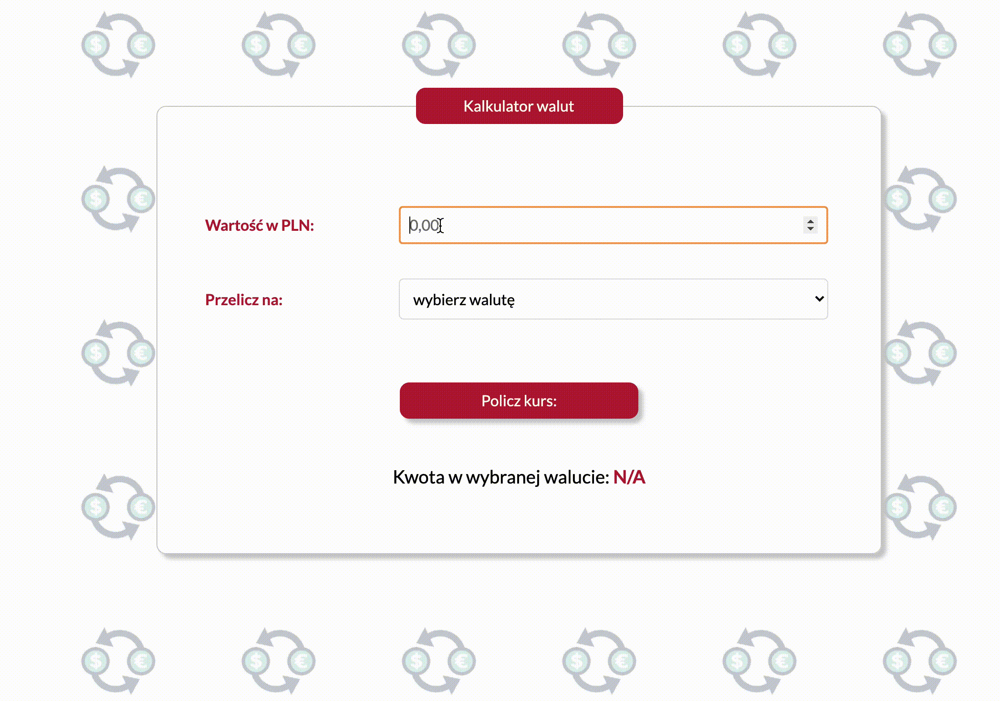

# currency-converter-1 
Author: Patrycja Lesniak

Simple currency converter - version 1 - converts PLN into other currencies based on the default exchange rate. 
Work in progress.

## Exchange rates as of May 2, 2021
- CHF = 4.1368;
- EUR = 4.5427;
- GBP = 5.2250;

#How to use:
1. Enter the amount in PLN.
2. Select a currency.
3. Click the button and read the value.

# Technologies
Project is created with:
* HTML;
* CSS;
* BEM;
* ES6+;

# Demo
https://trishya800.github.io/currency-converter-1/

# Currency converter - version 1 - website
;

